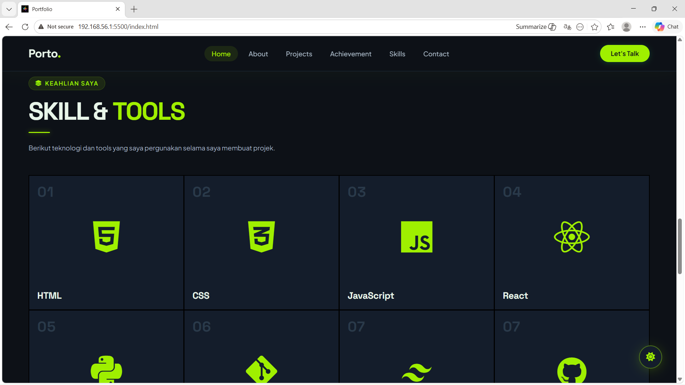

# **Website Portofolio**

## 📄 Deskripsi

website portofolio ini merupakan representasi digital dari karya dan kemampuan saya sebagai web developer.

Dengan desain yang modern dan responsif, website ini menampilkan berbagai proyek yang telah saya kerjakan serta menunjukan keahlian saya dalam membangun website yang fungsional dan menarik.

## 🚀 Fitur

- Halaman Projek
- Halaman Pencapaian
- From Kontak
- Download CV
- Light_Mode and Dark_Mode
- Navigasi Interaktif

# 🛠️ Teknologi & Tools

- HTML
- CSS
- JavaScript
- AOS (Animate On Scroll)
- Canva (Tools)

# 🌐 preview website

## Hero

##### **Light_Mode**

##### **Dark_Mode**

## Skill & Tools

##### **Light_mode**

##### **Dark_mode**

<picture>
  <source media="(prefers-color-scheme: dark)" srcset="https://raw.githubusercontent.com/HEXS1010/HEXS1010/output/pacman-contribution-graph-dark.svg">
  <source media="(prefers-color-scheme: light)" srcset="https://raw.githubusercontent.com/HEXS1010/HEXS1010/output/pacman-contribution-graph.svg">
  
</picture>

###

