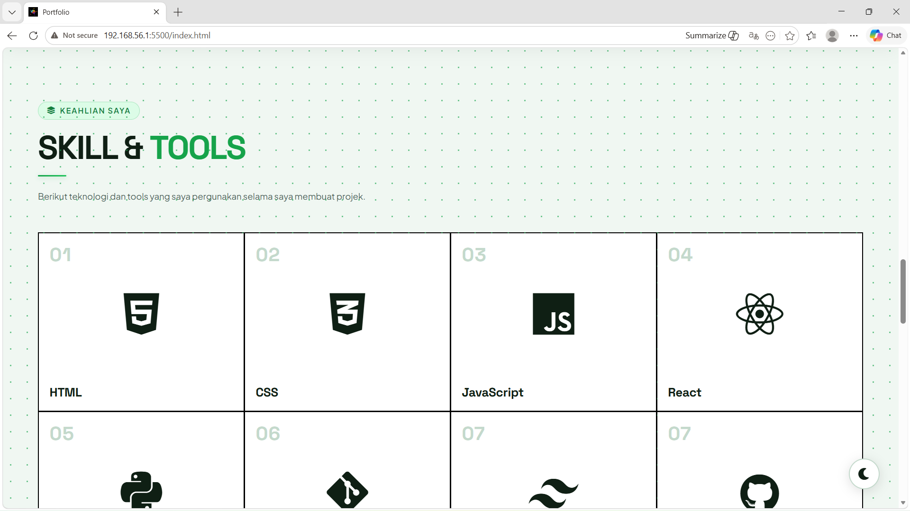
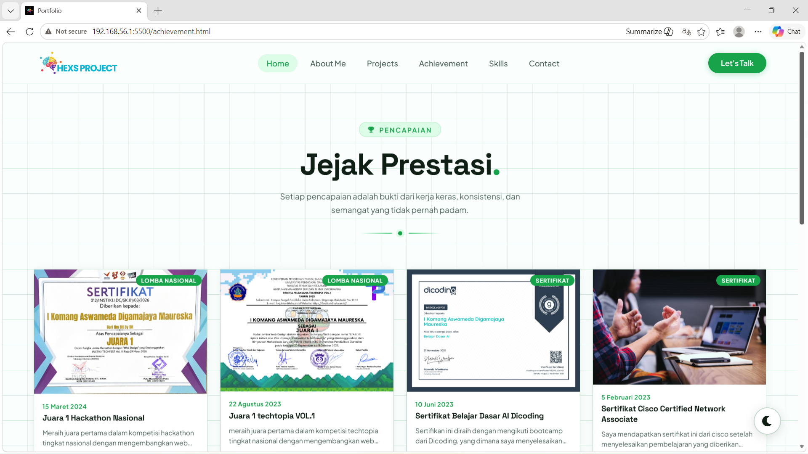
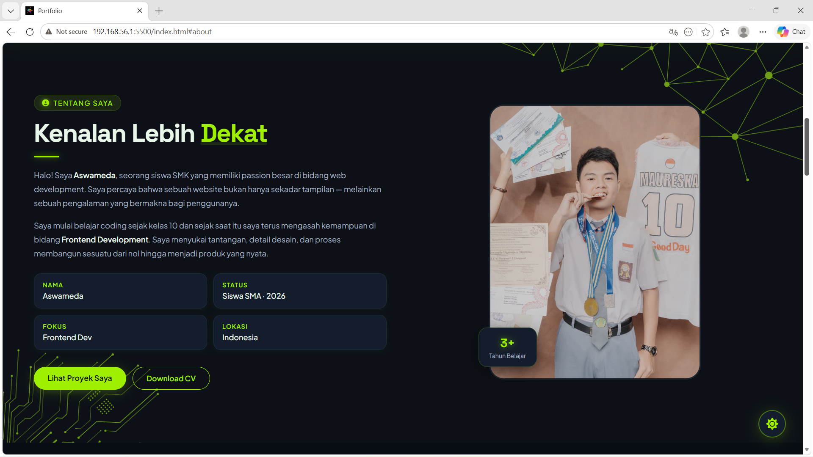
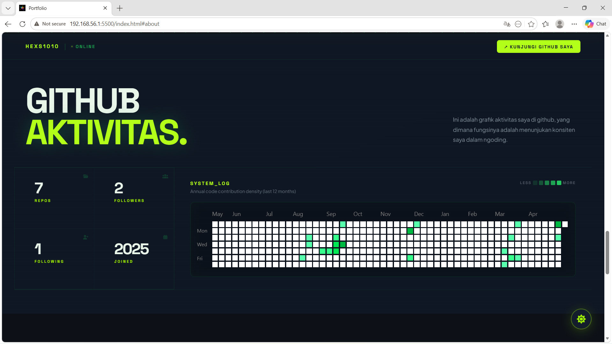
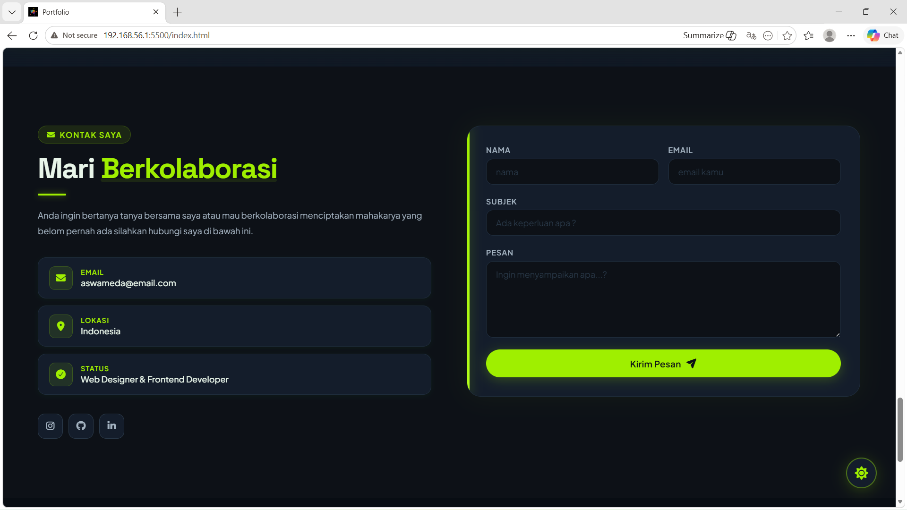
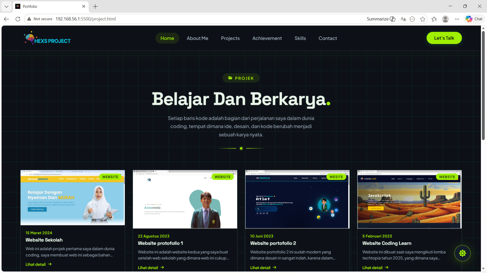

<h1 align="center">💼💼Website Portofolio💼💼</h1> 

## 🙍‍♂️ Identitas
Nama: I Komang Aswameda Digamajaya Maureska  
Instansi: SMA (SLUA) SARASWATI 1 DENPASAR

## 📄 Deskripsi

Di era digital yang terus berkembang pesat, kehadiran online yang kuat menjadi salah satu kunci utama dalam membangun karier di bidang teknologi. Web portofolio ini dibuat sebagai wadah untuk menampilkan karya, kemampuan, dan perjalanan saya sebagai seorang Frontend Developer secara profesional. Melalui portofolio ini, saya ingin membuktikan bahwa setiap proyek yang telah saya kerjakan bukan sekadar tugas, melainkan hasil dari dedikasi, kreativitas, dan keinginan untuk terus belajar dan berkembang.

## 🚀 Fitur

- Halaman Projek
- Halaman Pencapaian
- From Kontak
- Download CV
- Light_Mode and Dark_Mode
- Navigasi Interaktif

## 🛠️ Teknologi & Tools

- HTML
- CSS
- JavaScript
- AOS (Animate On Scroll)
- Canva (Tools)

## ⚙️ Cara Menjalankan 

# 🌐 preview website

<h2 align="center">Light_Mode 🌤️🌤️</h2> 

 
 

<h2 align="center">Dark_Mode 🌙🌙</h2> 

